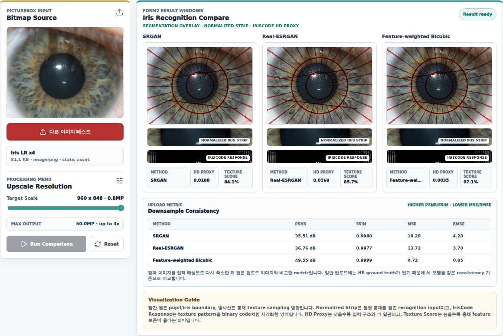
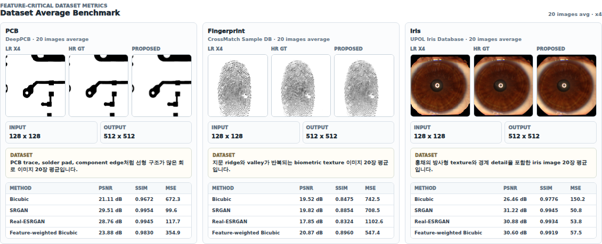

# Feature Point SR/Bicubic Interpolation

의료/산업/생체 영상처럼 구조 정보가 중요한 이미지에서는 단순히 픽셀을 부드럽게 키우는 보간보다, 경계와 반복 질감을 얼마나 보존하는지가 더 중요합니다. 이 프로젝트는 기존 Bicubic interpolation에 edge, ridge, radial texture 기반 feature map을 결합해 x4 확대 결과를 개선하고, SRGAN/Real-ESRGAN과 같은 딥러닝 SR 모델과 같은 조건에서 비교한 실험형 포트폴리오 프로젝트입니다.

## Why This Project Matters

일반적인 Bicubic interpolation은 계산이 빠르고 안정적이지만, 영상 안에서 중요한 구조와 덜 중요한 배경을 동일한 방식으로 다룹니다. PCB 회로 패턴, 지문 ridge, 홍채 radial texture처럼 얇은 선과 반복 구조가 핵심인 데이터에서는 이 방식만으로는 구조 보존을 설득력 있게 설명하기 어렵습니다.

그래서 이 프로젝트는 단순 확대 결과만 보여주는 데서 멈추지 않고, feature-sensitive 영역을 감지한 뒤 해당 영역의 보간 가중치를 조정하는 방식으로 접근했습니다. 또한 SRGAN, Real-ESRGAN, Feature-weighted Bicubic 결과를 같은 x4 조건에서 비교하고 PSNR, SSIM, MSE, RMSE 지표로 검증했습니다.

## Demo UI

고정 샘플과 벤치마크 결과는 프론트엔드 asset으로 제공해 페이지 진입 즉시 재현 가능한 결과를 보여주고, 사용자가 `다른 이미지 테스트`를 선택했을 때만 실제 API inference를 호출하도록 분리했습니다. 포트폴리오 화면에서는 정적 결과와 실시간 API 테스트 경로가 한 화면에서 자연스럽게 드러나도록 구성했습니다.



## API-Connected Test Flow

사용자는 서버에 준비된 iris 이미지 목록에서 테스트 파일을 선택합니다. 선택된 파일은 이 프로젝트의 .NET API로 전달되고, 같은 입력에 대해 SRGAN, Real-ESRGAN, Feature-weighted Bicubic 결과를 생성합니다.

API 입력과 출력 구조는 다음처럼 단순하게 유지했습니다.

```text
GET  /api/bicubic/files
GET  /api/bicubic/server-image?relativePath={fileName}
POST /api/bicubic/interpolate

FormData:
  image
  scaleFactor=4
  featureWeightPercent
  mode=srgan | real-esrgan | feature-weighted

Response:
  output.resultImage
  metrics.psnrDb
  metrics.ssim
  metrics.mse
  metrics.rmse
  metrics.mae
```

## Experiment Design

실험은 구조 보존이 중요한 세 가지 데이터 도메인으로 구성했습니다.

- PCB: 회로 trace, solder pad, component edge처럼 선형 구조가 많은 검사 이미지
- Fingerprint: ridge와 valley가 반복되는 생체 texture 이미지
- Iris: radial texture와 동공/홍채 경계가 중요한 홍채 이미지

각 도메인에서 20장씩 고정 샘플을 준비하고, HR 512x512 이미지를 LR 128x128로 축소한 뒤 x4 복원 결과를 비교했습니다. 화면의 고정 벤치마크 이미지는 실험 산출물 중 필요한 결과만 front asset으로 옮겨 사용하고, 서버에는 `다른 이미지 테스트`에 필요한 iris 입력 데이터만 남겼습니다.



## Results

Feature-weighted Bicubic은 Bicubic 대비 PCB, Fingerprint, Iris 평균 PSNR을 모두 개선했습니다.

| Dataset | Bicubic PSNR | Feature-weighted PSNR | Gain |
| --- | ---: | ---: | ---: |
| PCB | 21.11 dB | 23.88 dB | +2.76 dB |
| Fingerprint | 19.52 dB | 20.87 dB | +1.35 dB |
| Iris | 26.46 dB | 30.60 dB | +4.15 dB |

특히 Fingerprint처럼 얇은 반복 texture가 많은 데이터에서는 SRGAN/Real-ESRGAN보다 Feature-weighted Bicubic의 평균 PSNR과 SSIM이 더 높게 나타났습니다. 딥러닝 SR 모델이 항상 모든 도메인에서 우월한 것이 아니라, 도메인 구조에 맞춘 고전 보간 개선도 충분히 의미 있는 baseline이 될 수 있음을 보여주는 결과입니다.

## Implementation

이 프로젝트는 UI, C# API, Python GPU benchmark 서비스를 분리해서 구성했습니다.

```text
bicubic_interpolation/
  api/                 # .NET 8 minimal API
  image_processing/    # feature map, filtering, interpolation pipeline
  benchmark/           # SRGAN / Real-ESRGAN inference service
  datasets/iris         # API test images exposed in the file picker
  score.py             # dataset preparation and metric scoring script
```

핵심 구현은 다음과 같습니다.

- `FeatureWeightMapBuilder`: edge, texture, local contrast 정보를 기반으로 feature weight map 생성
- `FeatureWeightedBicubicInterpolator`: feature weight를 기존 Bicubic 보간 결과에 반영
- `SuperResolutionBenchmarkTools`: LR/HR 변환과 PSNR, SSIM, MSE, RMSE 계산
- `SrganInferenceClient`: SRGAN/Real-ESRGAN inference service 호출
- `score.py`: PCB, Fingerprint, Iris 데이터셋 준비 및 전체 metric table 생성

## Tech Stack

- Frontend: React, Vite, CSS module-style page layout
- Backend: .NET 8 Minimal API, C#
- Image Processing: SixLabors ImageSharp, custom interpolation pipeline
- SR Benchmark: Python, PyTorch, SRGAN, Real-ESRGAN
- Runtime: Docker Compose, GPU inference container
- Validation: Playwright screenshot capture, PSNR/SSIM/MSE/RMSE metric comparison

## What I Wanted To Show

이 프로젝트에서 보여주고 싶었던 점은 “모델을 붙였다”가 아니라, 영상 도메인의 특징을 보고 실험 구조를 설계했다는 점입니다. 단순 확대 API를 만드는 대신, 왜 feature-aware 보간이 필요한지 설명하고, 동일한 입력 조건에서 전통 보간, 딥러닝 SR, 제안 방식의 차이를 시각적 결과와 수치 지표로 함께 검증했습니다.

또한 포트폴리오 페이지에서는 고정 결과를 static asset으로 바로 보여주고, 실제 API inference는 사용자가 다른 이미지를 선택했을 때만 호출하도록 구성했습니다. 덕분에 데모 화면은 빠르게 열리면서도, API 연결성과 실험 재현성을 동시에 보여줄 수 있습니다.
